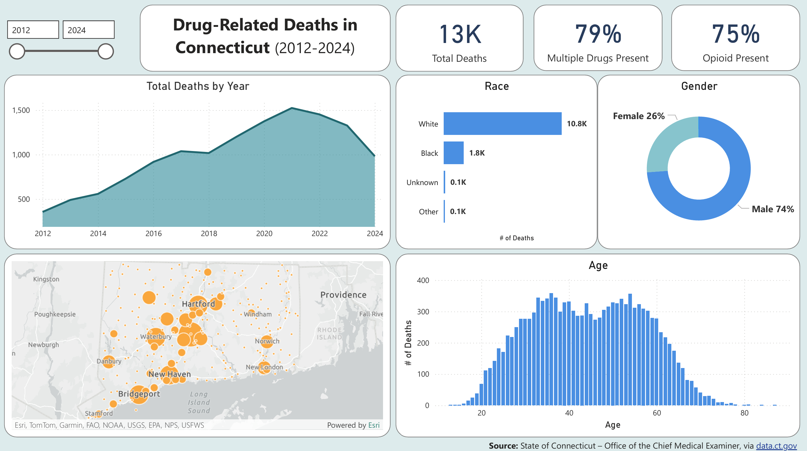

# Drug-Related Deaths in Connecticut (2012–2024)
**By Nick Gasperi**

[*Click here to view the full GitHub Repository*](https://github.com/nickgasperi/ct-drug-deaths-analysis)

  

## **Project Background**
This project analyzes data on accidental drug-related deaths in Connecticut from 2012–2024 to determine the most common factors associated with fatal overdoses. The purpose of this analysis is to highlight demographic, geographic, and substance-related patterns that contribute to overdose mortality. These findings will provide a foundation for future research and support initiatives aimed at reducing drug-related deaths at the state level.
 

## **Objectives**
1. Identify at-risk demographic groups within Connecticut's population.
2. Identify where fatal overdoses are most likley to occur.
3. Identify the types of drugs most frequently involved in fatal overdoses.
4. Form recommendations to shape future research and highlight opportunities for prevention.

## **Data Overview**
The data used in this project was published by the State of Connecticut via [data.gov](https://catalog.data.gov/dataset/accidental-drug-related-deaths-2012-2018). The dataset includes a single table containing 12,963 records, each representing a drug-related death. Each record contains information regarding the deceased's demographics, location of death, and drugs identified in the autopsy. This dataset separates *Ethnicity* and *Race* into distinct variables. Ethnicity indicates whether the individual was Hispanic/Latino, while Race does not include a Hispanic/Latino category. This distinction is important when comparing these results to other state-level demographic data sources, which may classify Hispanic/Latino within *Race*. As a result, the large proportion of individuals identified as White in this dataset may appear inflated relative to other sources that do not distinguish between *Ethnicity* and *Race*. 

## **Executive Summary**
The number of fatal overdoses in Connecticut rose steadily each year from 2012–2020, before peaking in 2021 at 1,524. Total deaths have decreased each year since 2022, dropping to 982 in 2024.  
Whites 83% and males 74%.  
The most common overdose location was the deceased's residence, 53% of . The second-most common place of death was in hospitals, accounting for 33% of deaths.  
Over 79% of the deceased tested positive for more than one type of drug, suggesting that combining drugs increases the likelihood of a fatal overdose. Opioids of any kind were present in 75% of deaths. The most prevalent individual drug was fentanyl, a type of opioid, found in 68% of deceased individuals.

## **Key Insights**
### **At-Risk Demographics**
* The majority of deceased individuals were identified as white, accounting for over 83% of all deaths in the dataset.
* 74% of the deceased were males.
* The average age was 44. The 30–49 age bracket suffered the most mortalities, accounting for 48% of total deaths. The next most [] age range was 50–64 at 33%.
* The under 30 and over 50 age groups do not deviate from the overall trend. Should expect these demographics to be valid moving forward when identifying at-risk groups.

### **Prevalent Overdose Locations**
* The most common place of death was the individual's residence at 53%. The second most common place of death was at a hospital.
* Despite people spending more time at home during the COVID pandemic, there was no notable rise in proportion of deaths at residences from 2020–2022.
* Cities with the highest population generally experienced the greatest number of fatal ovedoes. Hartford, New Haven, Waterbury, and Bridgeport are 4 of 5 most populous cities in Connecticut, and are also among the 5 cities with the most deaths in the dataset.
* Stamford, the 2nd most populous city in Connecticut, accounted for just the 15th most total deaths from 2012–2024 with 136. Stamford's number of deaths in residences and hospitals followed the overall trend.

### **Leading Drug Types**
* 79% of decedents tested positive for more than one type of drug, signaling increased risk of mixing drug types.
* 75% of overdoses involved an opioid. Fentanyl, a class of opioid, was the most commonly found drug, present in 68% of individuals.
* Other frequent substances include cocaine, which was present in 40% of deaths, and heroin at 28%.

## **Recommendations**
1. (gender / race / age)
2. (location) Investigate first responder response times to house calls in [most common cities and remote areas].
3. opioids, specifically fentanyl. Laced or taking it straight?
4. Examine additional demographic, socioeconomic, and other characteristics exhibited by Stamford's population to identify why fewer fatal overdoses occured, despite a high population.
5.  experienced such few accidential drug-related deaths? And why Meriden so many? Examine additional statistics to , such as median income, poverty rate, and demographics by city.