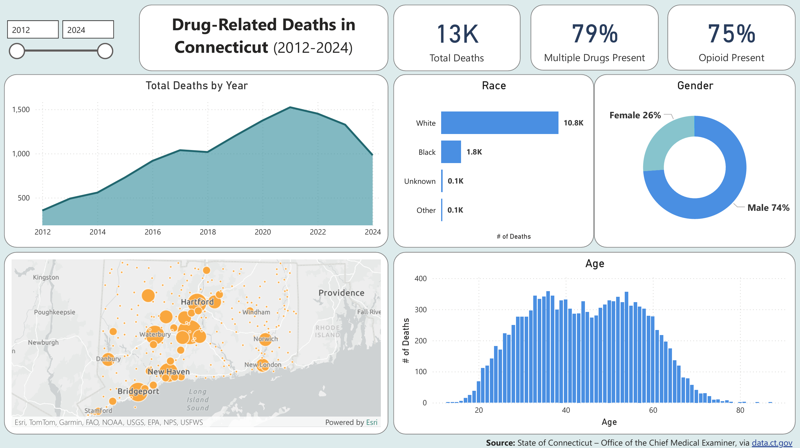

# Drug-Related Deaths in Connecticut (2012–2024)
**By Nick Gasperi**

   
  <a href="https://github.com/nickgasperi/ct-drug-deaths-analysis/raw/main/powerbi/ct-drug-deaths-analysis_public.pbix"
  style="font-size:12px; font-style:italic;">
    Download Interactive Dashboard
  </a>

## **Project Background**
This project analyzes data on accidental drug-related deaths in Connecticut from 2012–2024 to determine the most common factors associated with fatal overdoses. The purpose of this analysis is to highlight demographic, geographic, and substance-related patterns that contribute to overdose mortality. These findings will provide a foundation for future research and support initiatives aimed at reducing drug-related deaths at the state level.

To view the full project on GitHub, click [here](https://github.com/nickgasperi/ct-drug-deaths-analysis)

## **Objectives**
1. Identify at-risk demographic groups within Connecticut's population.
2. Identify where fatal overdoses are most likely to occur.
3. Identify the types of drugs most frequently involved in fatal overdoses.
4. Form recommendations to shape future research and highlight opportunities for prevention.

## **Data Overview**
The data used in this project was published by the State of Connecticut via [data.gov](https://catalog.data.gov/dataset/accidental-drug-related-deaths-2012-2018). The dataset includes a single table containing 12,963 records, each representing a drug-related death. Each record contains information regarding the deceased's demographics, location of death, and types of drugs identified in the autopsy. This dataset separates *Ethnicity* and *Race* into distinct variables. *Ethnicity* indicates whether the individual was Hispanic/Latino, while *Race* does not include a Hispanic/Latino category. This distinction is important when comparing these results to other demographic data sources, which may classify Hispanic/Latino within *Race*.

## **Executive Summary**
The number of fatal overdoses in Connecticut rose steadily each year from 2012–2020, peaking in 2021 at 1,524 deaths. Total deaths have decreased each year since 2022, dropping to 982 in 2024. The majority of decedents were White (83%), and male (74%). Individuals who were both White and male accounted for 61% of the population in the dataset. The most common overdose location was the deceased's residence (43%), while hospitals were the second-most common location (24%). Over 79% of decedents tested positive for more than one type of drug. The most prevalent class of drug was opioids, present in 75% of cases. The most common individual drug was fentanyl, a type of opioid, found in 68% of decedents.

## **Key Insights**
### **At-Risk Demographics**
* The majority of decedents were White, accounting for over 83% of total deaths.
* 74% were male, and 61% were both White and male.
* The average age at death was 44 years. The 30–49 age group accounted for the greatest number of deaths with 6,192 (48% of total), followed by the 50–64 group with 4,295 deaths (33% of total).
* Teenagers represented <1% of the population, with 87 total deaths.

### **Prevalent Overdose Locations**
* The most common place of death was the decedent's residence (43%), followed by hospitals (24%).
* The largest cities generally experienced the greatest number of fatal overdoes. Hartford, New Haven, Waterbury, and Bridgeport—four of five most populous cities in Connecticut—were also among the top five cities in total deaths.
* Stamford, despite having the second-highest population in Connecticut, accounted for just the 15th most total deaths with 136.

### **Leading Drug Types**
* 79% of decedents tested positive for more than one type of drug.
* Opioids were present in 75% of overdoses. Fentanyl was the most prevalent drug, detected in 68% of cases.
* Other common substances included cocaine, present in 40% of deaths, and heroin in 28%.

## **Recommendations**
1. Compare the significant presence of White and male decedents in the dataset to statewide demographic figures to determine whether these groups are overrepresented in fatal overdoses. 

2. Measure the proximity of residences where overdoses occurred to the nearest hospital to explore whether access to timely emergency care affects overdose mortality. 

3. Investigate why Stamford, despite a large population, had relatively few overdose deaths by examining additional demographic, socioeconomic, and public health factors.

4. Conduct further analysis into polysubstance use to determine whether certain drug combinations are associated with higher risk of experiencing a fatal overdose.

5. Compare the significant presence of opioids in Connecticut fatal overdoses to national trends to evaluate whether state-level policies should prioritize reducing opioid presence.

## **Assumptions & Caveats**
* About 18% of records did not include a death location, resulting in an understaded proportion of deaths occuring at residence and hospitals. Excluding null values, 53% of deaths occurred at residences and 29% occurred at hospitals.
* since *Ethnicity* was mostly nulls, was not considered in the analysis

